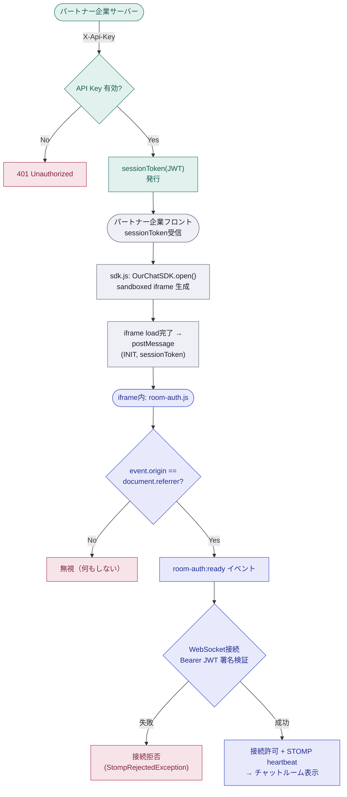
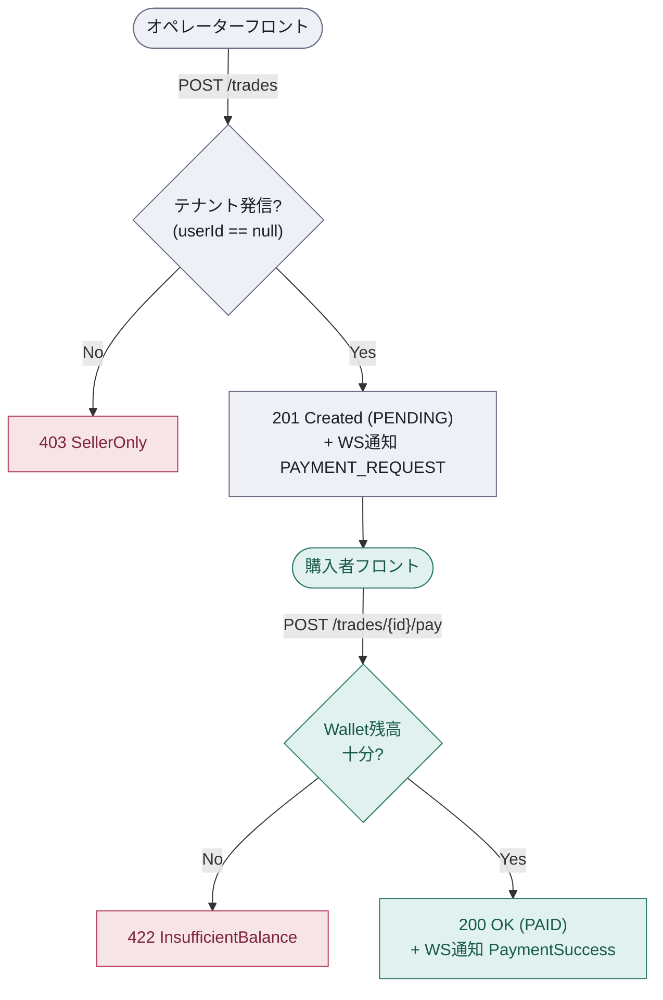

# Chat Payment SaaS

パートナー企業が自社サービスに組み込める、オペレーターと購入者による1対1のリアルタイムチャット決済プラットフォーム。複数のパートナー企業が同一プラットフォームを共有しながら、顧客データは完全に隔離される（マルチテナント方式）。

---

## 進捗状況

- [x] チャットメッセージ送受信・WebSocketリアルタイム通信（再接続キャッチアップAPI含む）
- [x] マルチテナント分離・BOLA対策
- [x] 決済リクエスト生成・処理（PENDING → PAID）
- [x] 埋め込みSDK（sdk.js / room-auth.js）
- [ ] Webhook通知（PAID → COMPLETED）
- [ ] 取消・返金API
- [ ] 埋め込みUI（room.html、フロント側で別途実装予定）

---

## 連携アーキテクチャ

パートナー企業サーバーは `X-Api-Key` でチャットルームを生成し、短期セッショントークンを自社ユーザーに伝達する。  
ユーザー（ブラウザ）はセッショントークンのみで WebSocket に接続し、`X-Api-Key` はブラウザに伝達されない。

パートナー企業フロントは `sdk.js` を読み込み、sandboxed `<iframe>`(`room.html`) を生成する。セッショントークンは URL パラメータではなく `postMessage` で iframe に渡され、iframe 内の `room-auth.js` は `document.referrer` との自己一貫性チェックでオリジンを検証してからのみトークンを信頼する。



---

## 決済（Trade）フロー

チャットルーム内でオペレーターが決済リクエストを送ると、購入者がそれを承認して決済が完了する。



チャットルームアクセス検証・決済メッセージ有効性・購入者本人確認など残りのゲートは `docs/ARCHITECTURE.md` に記載している。

---

## 技術スタック

| 項目 | 内容 |
|------|------|
| Language | Java 25 |
| Framework | Spring Boot 3.5.9 |
| Build | Gradle 8.14 |
| ORM | Spring Data JPA + QueryDSL |
| Realtime | Spring WebSocket (STOMP) |
| DB | MySQL 8.4 |

---

## マルチテナントアーキテクチャ

複数のパートナー企業が単一データベースを共有しながら、データは完全に隔離される。

- **Shared DB / Shared Schema** 戦略を採用
- Hibernate 6 の `@TenantId` に基づくRow-level隔離
- すべてのクエリに自動的にパートナーID フィルターを適用

---

## ローカル実行

### 1. MySQL 8.4 を準備

任意の方法（ローカルインストール、Docker、クラウドDBなど）で MySQL 8.4 を用意し、データベースを作成してください。

### 2. `application.yml` を作成

`src/main/resources/application.yml` ファイルを直接作成します（セキュリティのため git 除外）

```yaml
spring:
  sql:
    init:
      mode: always
  datasource:
    url: jdbc:mysql://localhost:3306/your-database-name
    username: your-username
    password: your-password
    driver-class-name: com.mysql.cj.jdbc.Driver
  jpa:
    hibernate:
      ddl-auto: create
    show-sql: true
    properties:
      hibernate:
        format_sql: true
        jdbc:
          batch_size: 50

jwt:
  secret: your-secret-key-here
  expiration-ms: your-expiration-ms-here
```

### 3. 実行

```bash
./gradlew bootRun
```

アプリケーションは `http://localhost:8080` で起動し、Swagger UI は `http://localhost:8080/swagger-ui.html` で利用可能です。
