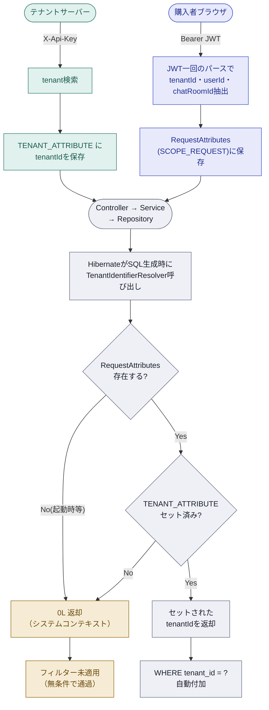
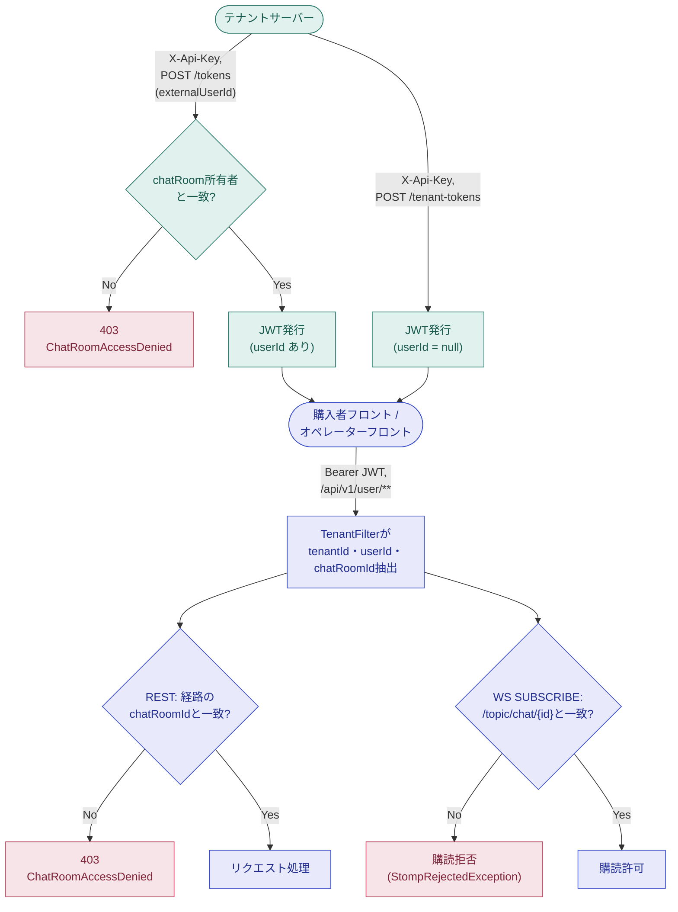
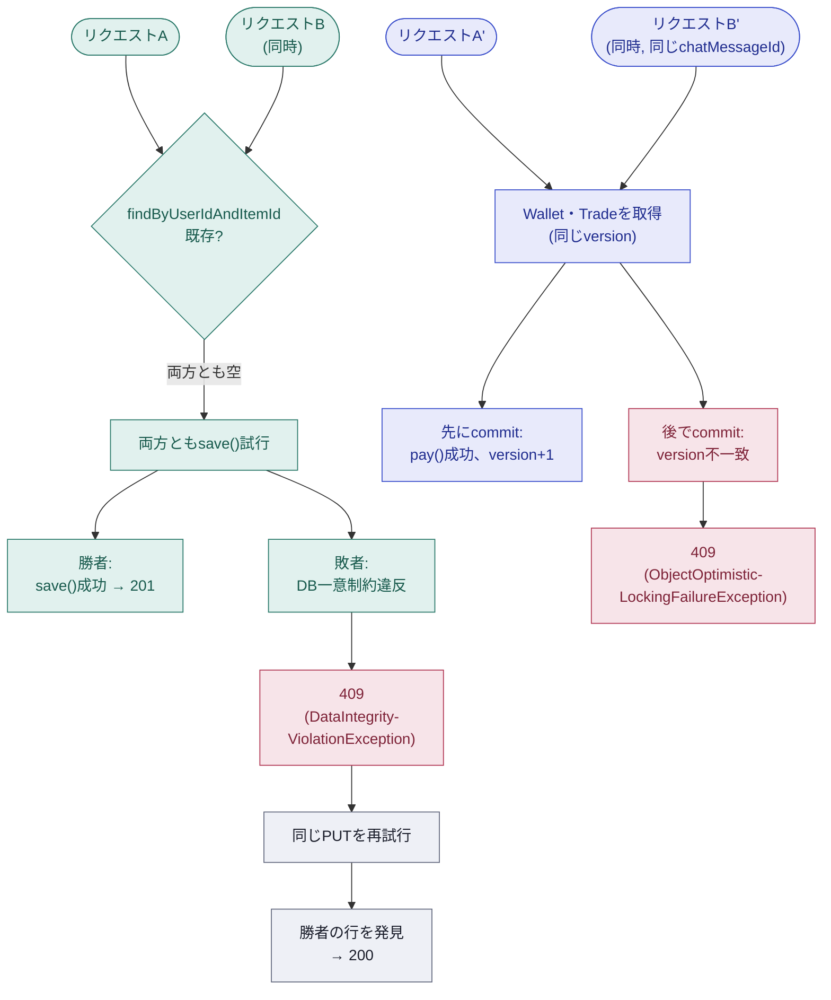
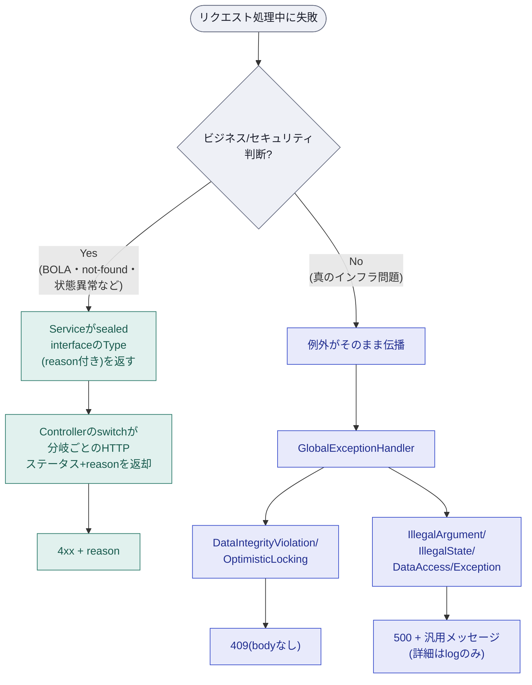
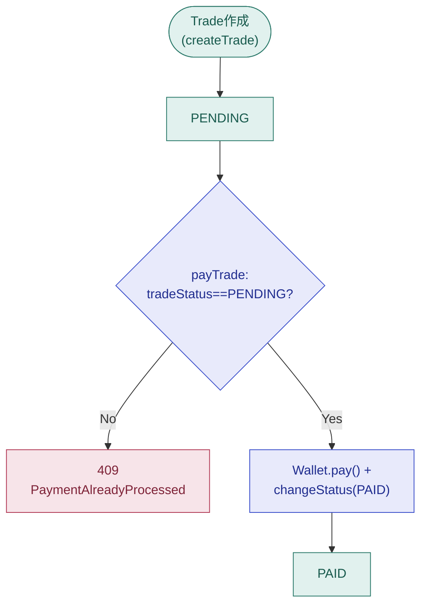
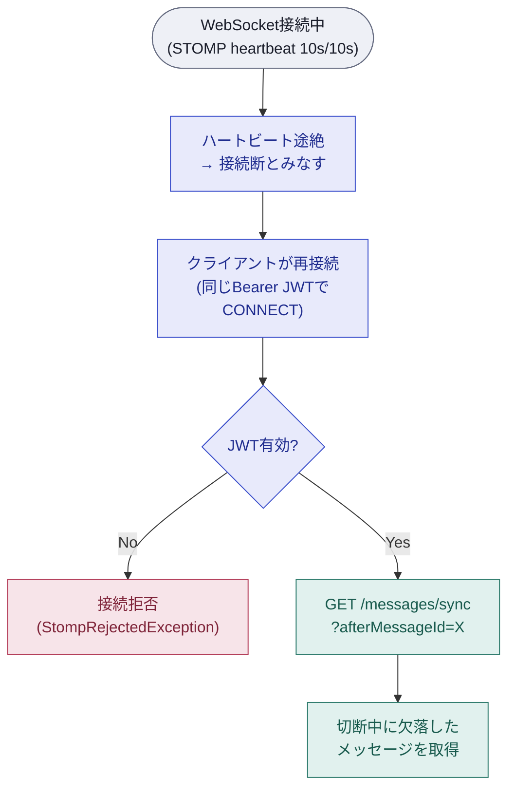
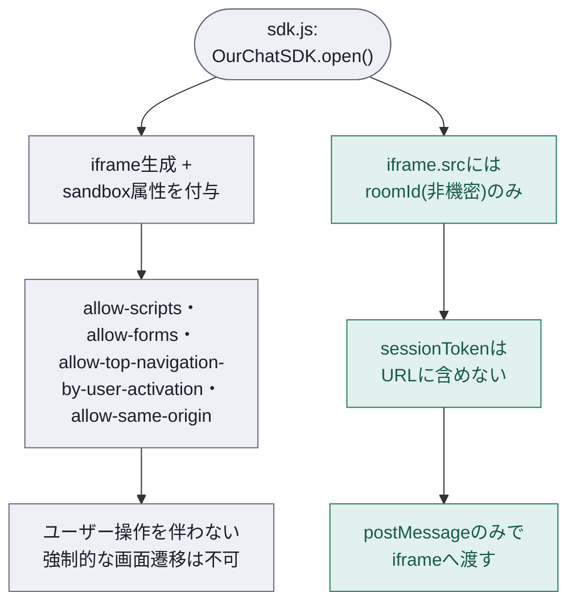

# Architecture

このシステムがなぜこの設計になっているか、実装の背景を記録する。

## 目次

1. [マルチテナント分離](#1-マルチテナント分離)
2. [認証/認可の境界](#2-認証認可の境界)
3. [同時実行制御・ロック戦略](#3-同時実行制御ロック戦略)
4. [エラー応答モデル](#4-エラー応答モデル)
5. [決済の状態遷移](#5-決済の状態遷移)
6. [WebSocketの信頼性](#6-websocketの信頼性)
7. [埋め込みSDKのセキュリティモデル](#7-埋め込みsdkのセキュリティモデル)

---

## 1. マルチテナント分離

Shared DB / Shared Schema 戦略。`BaseEntity`の全エンティティに `@TenantId` を付け、Hibernateの `CurrentTenantIdentifierResolver` にリクエストスコープの値を読ませることで、アプリケーションコードが `WHERE tenant_id = ?` を一切書かずに済む。

**要点**
- 単一Filterで両方処理: Bearer経路は `tenantId`・`userId`・`chatRoomId` が同じJWTから出るため、別Filterに分けると署名検証の重複と `@Order` 依存の暗黙結合が発生 → あえて統合
- `RequestAttributes(SCOPE_REQUEST)`: リクエスト完了時にSpringが自動破棄、手動 `clear()` 不要
- `0L` フォールバック: 起動時のシステムコンテキストと、`X-Api-Key` 検索時点（まだ `tenantId` 未セット）の2箇所で発生

---

## 2. 認証/認可の境界

**要点**
- オペレータートークン(`issueTenantToken`)は所有権チェック不要: `userId = null` で「誰の物」ではなく「テナント所属」だけ証明すればよく、それは発行時点の `X-Api-Key` で既に検証済み
- 購入者トークン(`issueUserToken`)のみ所有権チェック: 発行時点で弾けば、不正な `chatRoomId` を指したトークン自体が生まれない
- REST・WS両方とも同じ原理でBOLA対策: JWT claimの `chatRoomId` を「そのトークンでアクセス可能な唯一の部屋」として扱い、経路変数／購読destinationと突き合わせる
- WSはCONNECT時にclaimをセッションに保存し、SUBSCRIBE時に突き合わせる: 接続と購読が別イベントのため、一時保存する仕組みが必要
- 統合契約の境界: 発行したトークンをテナントサーバーからテナントフロントへ渡す方法（SSR埋め込み、自前APIなど）はテナント側の実装次第で当システムの管轄外。`sdk.js`の`OurChatSDK.open({ sessionToken, ... })`はテナントフロントが既にトークンを持っている前提で呼ばれる

---

## 3. 同時実行制御・ロック戦略

**要点**
- ChatRoom生成競合: サービス層でcatch/再照会を一切しない — DB一意制約違反をそのまま伝播させ、`GlobalExceptionHandler`が409に統一
- 409を受けたら同じPUTを再試行する — 409が返る時点で勝者のコミットは既に完了しているため、再試行は200で確定する
- 冪等性の根拠: RFC 9110の冪等性定義は応答コードではなく「サーバーへの効果」が基準 — 201でも(再試行後の)200でも、最終的にその部屋が1つだけ存在するという状態は変わらないため冪等
- Trade決済の同時実行: WalletとTrade両方に`@Version` — 後発コミットはversion不一致で失敗し、二重決済・二重引き落としを防ぐ
- 再試行はクライアントの責任: サーバー側は楽観ロック失敗をそのまま409として返すだけ

---

## 4. エラー応答モデル

**要点**
- ビジネス/セキュリティ判断は例外ではない: BOLAチェックなどは「バグ」ではなく正常な判断のため、値(sealed interface)で表現する。switch式は全permitsを尽くさないとコンパイルエラーになるため、新しい失敗ケースを追加した時の対応漏れが構造的に起きない
- Controllerのswitchは受け取った型に応じたHTTPステータス+reasonを直接返却する
- `GlobalExceptionHandler`は大きく2種を扱う: 同時実行の衝突(409)と、それ以外の予期しないバグ/インフラ例外(500、詳細はlogのみ) — 業務ロジックとは重ならない
- WebSocketも同じ構成: `MessageDeliveryException`(Spring)を`StompRejectedException`(独自)に置換、クライアントには一般化したメッセージのみ返す

---

## 5. 決済の状態遷移

**要点**
- `TradeStatus`は5値宣言済み（PENDING/PAID/COMPLETED/CANCELLED/REFUNDED）だが、実装済みの遷移はPENDING→PAIDのみ
- 「すでに処理済み」を防ぐ層が2つある理由: `checkPayableTrade`は連続的な二重実行（例: 支払い済みのボタンをもう一度押す）を防ぐが、同時に来た2件までは防げない。本当に同時に来たリクエストの競合は3番の`@Version`が拾う — 前者はreason付き409、後者はbodyなし409
- `Trade.changeStatus()`は`tradeStatus != PENDING`なら`IllegalStateException`を投げる — 不変式をエンティティ自身に持たせることで、呼び出し元が増えても保護に漏れが生じない

---

## 6. WebSocketの信頼性

**要点**
- ハートビートがWebSocket特有の「沈黙した切断」を検知する唯一の手段: TCP接続は切れれば即座にわかり、メッセージだけ静かに消えることはない
- 再接続後は新しいトークンの発行が不要 — 同じBearer JWTをそのまま`CONNECT`に再利用し、`GET /messages/sync`で切断中のメッセージだけ取り戻す
- `MessageDeliveryException`(Spring)ではなく`StompRejectedException`(独自)を使う理由: SpringはSTOMP ERRORフレームの`message`ヘッダーに例外メッセージをそのまま載せてクライアントへ送る — RESTなら`GlobalExceptionHandler`が常に一般化した文言に包み直すが、STOMPにはその保護がない。将来メッセージに内部詳細（署名検証の失敗理由など）を書いてしまうと、そのままクライアントへ漏れる。`StompRejectedException`に置き換えることで、返す文言を`MessageResolver`経由の一般化されたものに固定する

---

## 7. 埋め込みSDKのセキュリティモデル

**要点**
- iframeに`sandbox`属性: `allow-top-navigation-by-user-activation`により、ユーザー操作を伴わない強制的なページ遷移（クリックジャッキング等の一部手法）を防ぐ
- `sessionToken`はURLに含めない: `iframe.src`にはroomId（非機密）のみ渡し、トークンはpostMessageでのみ送る — URLはブラウザ履歴やRefererヘッダーに残ってしまうため
- postMessage送受信時のorigin検証は`README.md`の「連携アーキテクチャ」図を参照 — `targetOrigin`を`SDK_ORIGIN`に限定し、受信側は`document.referrer`との自己一貫性を確認する
